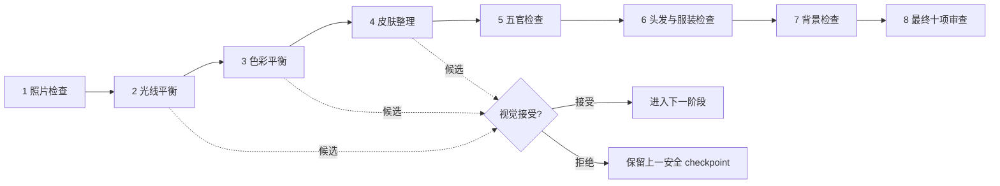

# Retouch Travel Portrait

[](https://github.com/aracelismorii/retouch-travel-portrait/actions/workflows/ci.yml)
[](https://github.com/aracelismorii/retouch-travel-portrait/releases)
[](https://www.python.org/)
[](LICENSE)

一个面向 Codex 和具备视觉能力 Agent 的自然旅行人像修图 Skill。

当前版本：`v0.7.0-beta`

它不会把照片一次性交给“美颜滤镜”然后直接宣告完成，而是把修图拆成固定顺序、可比较、可拒绝、可回滚的工作流。默认使用本地确定性图像处理，并要求在每个真正改变像素的候选结果后进行视觉确认。

> 核心目标：让照片看起来是“拍得更好”，而不是“换了一个人”。

- [下载最新 Beta](https://github.com/aracelismorii/retouch-travel-portrait/releases/tag/v0.7.0-beta)
- [查看完整 Skill 协议](retouch-travel-portrait/SKILL.md)
- [查看真实图片验证报告](REAL_IMAGE_VALIDATION.md)
- [查看发布验证规则](VALIDATION.md)

## 这个 Skill 解决什么问题

旅行照片常见的问题并不一定需要重新生成整张图片：曝光不均、白平衡偏色、肤色不协调、轻微泛红、背景和人物明暗脱节，都可以通过克制的局部或全图处理改善。

直接套滤镜或使用生成模型一次性重画，容易出现皮肤蜡化、五官漂移、背景线条弯曲、比例改变、发丝粘连和风格过重等问题。本 Skill 把“生成候选”和“接受结果”分开：工具只能提供候选，最终是否保留必须由人或具备视觉能力的 Agent 根据证据判断。

## 使用它的好处

| 好处 | 对实际修图的价值 |
|---|---|
| 更自然 | 默认参数克制，保留毛孔、细纹、痣、雀斑、自然高光和原始肤色底色，避免常见的塑料皮肤 |
| 不改变人物身份 | 明确禁止换脸、瘦脸、五官重塑、身体塑形、年龄变化和表情变化 |
| 不容易拉伸或裁坏 | 候选必须通过画布和宽高比检查；禁止缩放、裁切、重采样、旋转和重新构图 |
| 每一步都能反悔 | 每个阶段先生成待审候选；拒绝候选会保留上一张安全 checkpoint，而不是继续把错误叠加下去 |
| 结果可解释 | 每个阶段都有作用范围、参数、审查备注和状态，不再是无法解释的“AI 已优化” |
| 有完整对比证据 | 自动生成并排图、差异热图、两组 100% 细节、720 像素缩略图和 1080 像素手机预览 |
| 默认更保护隐私 | 默认确定性路径只依赖 Pillow 和 NumPy，不需要把照片上传到图片模型服务 |
| 适合重复工作流 | 单图和文件夹队列都使用相同阶段、参数和审查规则，便于让多个 Agent 采用一致标准 |
| 批量失败可隔离 | 每张图片拥有独立 run；一张失败不会污染其他照片，也不会迫使整批错误接受 |
| 模型使用受限制 | 可选图片模型路径最多记录一次候选，不允许模型链式重画或无限重试 |

OpenAI 将 Skill 描述为可供 Codex 保存和重复使用的工作流。本项目在此基础上增加了面向人像修图的固定阶段、证据绑定和人工审查门。参见 [OpenAI 官方用例：Save workflows as skills](https://learn.chatgpt.com/use-cases)。

## 当前能做什么

- 修正单人旅行人像的整体曝光、高光和阴影关系；
- 改善主体与背景之间的亮度协调；
- 克制地修正白平衡和全图色彩；
- 在保留纹理的前提下轻微整理肤质、临时泛红和小范围肤色不均；
- 提供 `natural`、`fresh` 和 `warm-film` 三种风格；
- 为单张图片创建可回滚的独立 run；
- 为文件夹内的多张图片创建相互隔离的队列；
- 生成绑定原图和候选哈希的视觉 proof；
- 在十项最终审查全部完成后输出结果。

## 当前明确不做什么

- 换脸或身份替换；
- 改变年龄、表情或人物姿势；
- 瘦脸、放大眼睛、调整鼻子、嘴唇或身体比例；
- 重妆、改变肤色底色或把皮肤整体漂白；
- 替换背景、凭空增加或删除物体；
- 儿童照片；
- 多位主要人物；
- 无人值守地自动接受所有候选；
- 把小样本测试结果宣传为普遍的 90% 审美成功率。

## 三种风格模式

模式只影响光线和全图色彩阶段。皮肤处理、安全边界、几何约束和十项审查在三种模式中保持一致。

| 模式 | 适合的效果 | 设计原则 |
|---|---|---|
| `natural` | 默认自然、旅行纪实、保留现场氛围 | 中性修正，不主动添加明显风格 |
| `fresh` | 更清透、通透、轻盈 | 轻抬中间调，保持皮肤自然，不把背景洗成粉白色 |
| `warm-film` | 轻微暖调、柔和反差、克制饱和度 | 避免橙色皮肤、青橙大片和伪造胶片划痕 |

如果不知道选什么，先用 `natural`。

## 最快使用方式

### 1. 下载或克隆仓库

```bash
git clone https://github.com/aracelismorii/retouch-travel-portrait.git
cd retouch-travel-portrait
```

也可以直接下载 [v0.7.0-beta Release ZIP](https://github.com/aracelismorii/retouch-travel-portrait/releases/tag/v0.7.0-beta)。

### 2. 安装运行依赖

需要 Python 3.9 或更高版本。

```bash
python3 -m pip install -r retouch-travel-portrait/requirements.txt
```

核心运行依赖只有 Pillow 和 NumPy。

### 3. 把 Skill 放入 Agent 可发现的目录

复制的是仓库内的整个 `retouch-travel-portrait/` 文件夹，其中必须保留 `SKILL.md`、`scripts/`、`references/` 和其他配套文件。

项目级 Codex 工作区可以使用：

```text
你的项目/
└── .agents/
    └── skills/
        └── retouch-travel-portrait/
            ├── SKILL.md
            ├── scripts/
            └── references/
```

如果安装到其他 Agent，请放入该 Agent 支持的 Skill 目录，并确保它能够读取 `SKILL.md`、运行 Python 脚本、查看图片以及暂停等待用户审查。

### 4. 直接告诉 Agent 你的目标

推荐提示词：

```text
使用 $retouch-travel-portrait，以 natural 模式自然地修饰这张旅行人像。
保留人物身份、五官比例、身体比例、原始画布和背景结构。
每个候选都先展示给我确认，最后完成十项视觉审查。
```

清透风格：

```text
使用 $retouch-travel-portrait，以 fresh 模式处理这张单人旅行人像。
效果保持轻微和自然，不要磨皮过度，不要改变肤色底色。
```

暖调胶片风格：

```text
使用 $retouch-travel-portrait，以 warm-film 模式处理这张照片。
只需要轻微暖色和柔和反差，不要橙色皮肤，也不要伪造胶片损伤。
```

## 工作流如何运行



八个阶段必须按顺序完成：

1. `photo_correction`：检查方向、地平线、透视、裁切和画布；MVP 默认只检查，不改变几何。
2. `light_balance`：处理曝光、高光、阴影和主体—背景亮度关系。
3. `color_balance`：修正白平衡并应用所选模式的克制色彩配方。
4. `skin_cleanup`：轻微整理临时瑕疵、泛红和不均匀，同时保留毛孔与细纹。
5. `facial_features`：检查五官、眼白、牙齿、嘴唇和眼下区域；默认本地路径不主动修改。
6. `hair_clothing`：检查发丝边缘、发型、衣物纹理和小干扰；默认本地路径不主动修改。
7. `background`：检查背景线条、透视和主体分离感；不替换背景。
8. `final_review`：比较不可变原图和最终候选，完成十项 proof-bound 审查。

“脚本运行成功”不等于“照片合格”。只有候选经过视觉确认，最终 proof、审查记录和文件哈希仍然一致时，run 才能完成。

## 可以控制哪些“美颜”参数

V6 参数位于 [`retouch-travel-portrait/references/model-parameters.json`](retouch-travel-portrait/references/model-parameters.json)。修改参数后必须重新编译计划；不要在已经开始的 run 中偷偷替换参数文件。

默认本地确定性路径使用以下参数：

| 参数 | 默认值 | 允许范围 | 控制内容 |
|---|---:|---:|---|
| `lighting_improvement` | 模式决定 | 0–0.50 | 全图曝光、高光、阴影和主体—背景亮度 |
| `white_balance_correction` | 模式决定 | 0–0.40 | 白平衡修正，不能改变皮肤底色 |
| `style_strength` | 模式决定 | 0–0.30 | `fresh` 或 `warm-film` 的全图风格强度 |
| `skin_smoothing` | 0.28 | 0–0.50 | 保留边缘和纹理的轻度皮肤平滑 |
| `blemish_reduction` | 0.30 | 0–0.50 | 临时瑕疵和临时泛红整理 |
| `skin_tone_evenness` | 0.25 | 0–0.45 | 小范围肤色不均，不允许改变肤色底色 |

三种模式的光线和色彩默认值：

| 模式 | 光线改善 | 白平衡修正 | 风格强度 |
|---|---:|---:|---:|
| `natural` | 0.25 | 0.18 | 0.00 |
| `fresh` | 0.32 | 0.22 | 0.18 |
| `warm-film` | 0.24 | 0.20 | 0.20 |

眼下柔化、五官定义、碎发、衣物和背景清理属于语义型参数。它们默认都是 `0`，只有明确启用可选图片模型路径时才允许产生语义候选；本地默认路径只检查并记录安全的 `no_change`。

建议一次只调整一个参数，使用同一张图做 A/B 对比，并重新完成十项审查。强度更高不代表更好；达到上限也不代表适合当前照片。

## 输入要求

公开 Beta 只接受符合以下全部条件的图片：

- JPG/JPEG、PNG 或 WebP，文件扩展名必须与真实编码一致；
- 单帧图片；
- 8-bit `RGB` 或 8-bit 灰度 `L`；
- 按 EXIF 方向显示后的短边至少 768 像素；
- EXIF Orientation 为 1、3、6 或 8；
- 一位主要成年人。

以下输入会被拒绝：透明/alpha、动画或多帧、CMYK、调色板或 16-bit 图片、镜像 EXIF 方向 2/4/5/7、损坏文件、扩展名与真实格式不匹配，以及超出安全像素限制的图片。

只做输入预检，不修改源文件：

```bash
python3 retouch-travel-portrait/scripts/input_preflight.py portrait.jpg
```

## 单图命令行工作流

一般用户推荐让 Agent 按 `SKILL.md` 操作。下面的命令用于开发、集成或调试。

编译计划并创建不可变 run：

```bash
python3 retouch-travel-portrait/scripts/compile_pipeline.py \
  --mode natural \
  --output plan.json

python3 retouch-travel-portrait/scripts/pipeline_state.py init portrait.jpg \
  --plan plan.json \
  --run-dir portrait-run
```

生成一个阶段候选：

```bash
python3 retouch-travel-portrait/scripts/execute_pipeline.py \
  --run-dir portrait-run \
  --stage light_balance
```

视觉比较后明确接受或拒绝，并写出当前照片专属的证据：

```bash
python3 retouch-travel-portrait/scripts/execute_pipeline.py \
  --run-dir portrait-run \
  --stage light_balance \
  --review-decision accept \
  --notes "面部与背景亮度仍协调，高光未溢出，原有夜景氛围得到保留"
```

检查型阶段或无需修改的阶段使用 `--confirm-inspection` 并提供具体理由。完整阶段协议见 [`SKILL.md`](retouch-travel-portrait/SKILL.md)。

## 最终十项视觉审查

最终阶段会生成：

- 原图与候选并排比较图；
- 差异热图；
- 两组原图/候选 100% 像素级细节；
- 720 像素缩略图；
- 1080 像素手机预览；
- 绑定原图、候选和所有 proof 文件 SHA-256 的 manifest。

必须逐项检查：

1. 毛孔、纹理和细纹是否保留；
2. 脸部和颈部肤色是否一致；
3. 可见的眼白和牙齿是否出现蓝色或青色偏色；
4. 嘴唇颜色、饱和度和边缘是否自然；
5. 门框、墙线、地平线等背景几何线是否仍然笔直；
6. 头发边缘、碎发、光晕和涂抹是否异常；
7. 主体与背景的曝光是否协调；
8. 100% 细节和缩略图是否同时自然；
9. 相对原图的变化是否过量；
10. 手机预览中的亮度、高光和阴影是否舒适。

每项备注都必须描述当前 proof 中真正看到的证据，规范化后至少 16 个字符。不能只写“通过”“没问题”，也不能堆砌关键词。如果某个对象确实不可见，可以使用 `not_applicable`，但仍要写清楚不可判断的原因。

示例：

```text
100% 细节中面颊毛孔和细纹仍清晰，没有出现蜡质涂抹。
```

```text
人物闭眼且没有露齿，眼白和牙齿均不可见，无法判断是否存在蓝偏色。
```

proof、候选、审查 JSON 或 manifest 一旦被替换或修改，哈希绑定就会失效，不能完成最终输出。

## 文件夹批量工作流

准备队列：

```bash
python3 retouch-travel-portrait/scripts/batch_pipeline_v6.py prepare \
  input-portraits output-queue \
  --mode natural
```

查看状态，不推进工作：

```bash
python3 retouch-travel-portrait/scripts/batch_pipeline_v6.py status \
  input-portraits output-queue
```

在完成当前人工或视觉 Agent 审查后继续队列：

```bash
python3 retouch-travel-portrait/scripts/batch_pipeline_v6.py resume \
  input-portraits output-queue
```

一次 `resume` 对每个独立 run 最多生成一个待审候选，或者在进入最终阶段时生成一套 proof。它不会自动接受候选、不会替用户填写审查备注、不会调用图片模型，也不会自动 finalize。

队列会区分 `complete`、`safe_but_subtle`、`partial_v3_fallback`、`failed`、`awaiting_review` 和 `prepared`。一张图片失败不会改变其他图片的 run。

## 可选图片模型路径

默认路径的模型调用数为 0。只有在用户明确同意并启用时，工作流才允许创建一次可选模型候选：

```text
reserve -> complete -> accept
                    -> reject
        -> fail
```

- 外部调用前必须先 `reserve-model-attempt`；
- 服务成功后必须 `complete-model-attempt` 并绑定候选；
- 服务失败使用 `fail-model-attempt`；
- 视觉不合格使用 `reject-model-attempt`；
- 只有 proof 和十项审查已接受时才能 `accept-model-candidate`；
- 成功、失败或拒绝都会永久消耗该 run 的一次记录名额；
- 不允许第二次 reserve、模型重试、模型候选链式输入或从上一候选继续重画。

这套状态机只能证明记录在本 Skill run 内的过程符合规则，不能独立证明操作者没有绕过 Skill 私下调用其他服务。

## 隐私与安全

- 默认本地确定性路径不需要把图片上传到图片模型服务；
- 在支持 POSIX 权限的平台上，run 和 queue 目录使用 `0700`，其中的敏感文件使用 `0600`；
- run 目录包含不可变原图副本、中间 checkpoint、proof、审查备注，并可能保留 EXIF/GPS；
- 可选模型路径可能把不可变原图交给第三方，使用前应取得照片所有者许可并确认服务的数据保存政策；
- 不要把真实照片、run、proof、队列 manifest、审查记录或 EXIF/GPS 提交到 GitHub；
- 本仓库和 Release ZIP 不包含真实测试人像。

## `v0.7.0-beta` 验证结果

发布前使用 12 张公开单人女性人像完成了一次 `natural` 模式聚焦验证，覆盖柔光、窗边、低照度、强红光、黑白、户外、传统服装、霓虹散景和高反差场景。

| 指标 | 结果 |
|---|---:|
| 输入预检 | 12/12 通过 |
| 完整工作流 | 12/12 完成 |
| 最终十项审查 | 12/12 接受 |
| 最终画布与原图一致 | 12/12 |
| 图片模型调用 | 0 |
| 确定性阶段候选 | 36 |
| 视觉接受候选 | 33 |
| 零像素变化候选 | 2 |
| 拒绝并回滚候选 | 1 |

候选接受率为 33/36，即 91.7%。这个数字只描述该次小样本中“阶段候选经过视觉审查后被保留”的比例，不是图片级审美成功率，也不代表 91.7% 的照片肉眼明显变好。

详细限制、逐阶段结果和异常案例见 [`REAL_IMAGE_VALIDATION.md`](REAL_IMAGE_VALIDATION.md)。机器可读的脱敏结果见 [`validation-summary.json`](validation-summary.json)。

## 自动化测试与发布验证

GitHub Actions 在 Python 3.9、3.10、3.11、3.12、3.13 和 3.14 上运行：

- 仓库与 Skill 结构验证；
- 完整单元测试；
- 从 Git 跟踪文件重新构建 Release ZIP；
- 检查 ZIP 是否包含图片、运行产物、缓存、路径泄漏或不安全成员；
- 解压精确 ZIP；
- 对解压后的仓库重新执行验证和完整测试。

本地开发验证：

```bash
python3 -m pip install \
  -r retouch-travel-portrait/requirements.txt \
  -r requirements-validation.txt

python3 scripts/validate_repo.py .

python3 -m unittest discover \
  -s retouch-travel-portrait/tests \
  -p "test_*.py" \
  -v
```

测试通过只能说明状态机、确定性操作、proof 绑定和失败处理符合当前规范，不能取代真实图片上的审美判断。

## 项目结构

```text
.
├── README.md                         # 本中文版项目说明
├── LICENSE
├── RELEASE_NOTES.md
├── VALIDATION.md                     # 发布门与测试边界
├── REAL_IMAGE_VALIDATION.md          # 12 张真实图片聚焦验证报告
├── validation-summary.json           # 脱敏机器可读汇总
├── scripts/
│   └── validate_repo.py              # 仓库与发布包验证
└── retouch-travel-portrait/
    ├── SKILL.md                      # Agent 必须执行的主协议
    ├── README.md                     # Skill 内部简要说明
    ├── requirements.txt
    ├── references/                   # 参数、阶段、审查门和模型提示词
    ├── scripts/                      # 单图、批量、proof、审查和状态脚本
    └── tests/                        # 自动化测试
```

## Beta 边界

这是一个公开 Beta，而不是生产级无人值守美颜服务：

- 所有候选都需要人或具备视觉能力的 Agent 审查；
- 自动指标可以拒绝明显风险，但不能单独自动接受语义质量；
- 当前没有自动成年人识别、身份认证或法律合规认证；
- 当前没有证明任意来源、任意光照和任意构图下的普遍成功率；
- 三种模式都不能保证适合每一种肤色、妆容、遮挡或相机条件；
- `natural` 默认宁愿变化轻微或保持不变，也不会为了“效果明显”强行修改。

## 参与开发

欢迎提交 Issue 或 Pull Request。提交真实图片相关问题时，请先删除人像、EXIF/GPS、绝对本地路径和其他敏感信息，优先提供脱敏后的日志、参数、失败阶段和可复现步骤。

## 许可证

本项目使用仓库 [`LICENSE`](LICENSE) 中声明的许可证。
